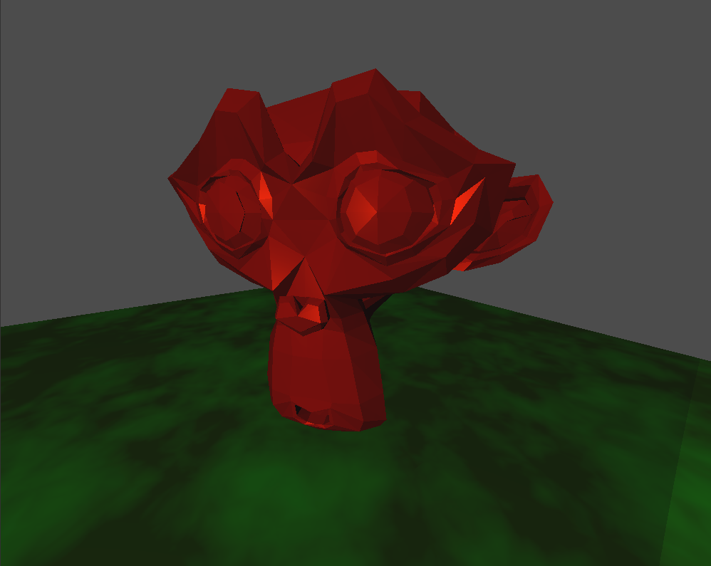
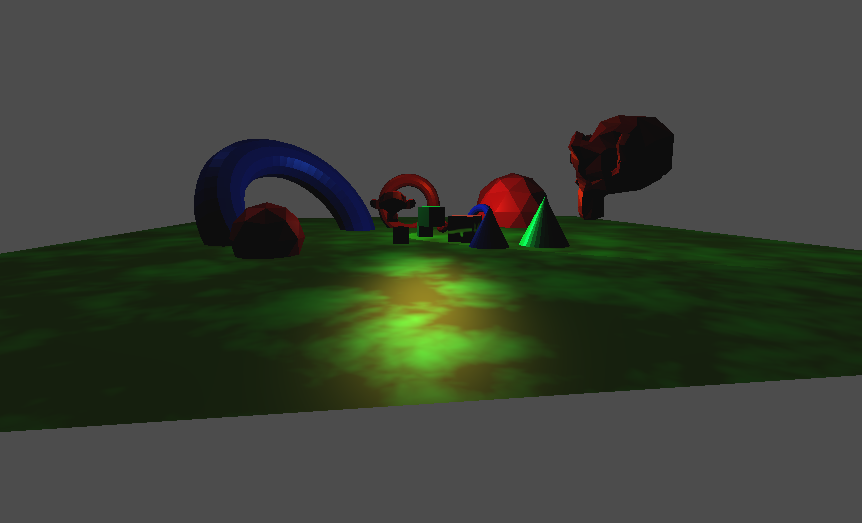
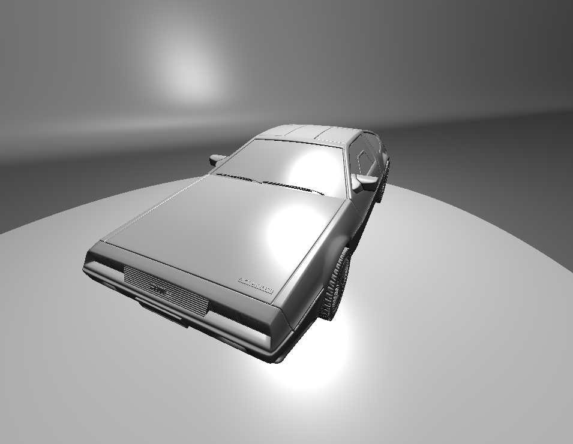

# mgf
Mars Graphics Framework

Works on current Linux Distributions

The example program will load a obj File from the res folder and allow you to move freely around it.

Its a OpenGL Engine that wrote for use in student projects. By now it has become frankensteins engine. I rewrote big parts of it multiple times as my knowledge and expirience grew. It was a great learning expirience, but it has still some major flaws, especially the scenegraph is a unholy mess. At this point i would have to rewrite it from scratch, but after more than a year of tingling with it I habe moved on to other projects.

#### Install and run example:
Compile with cmake: 
mkdir build 
cd build 
cmake .. 
make 
ln -s ../res res 

run: 
./mgf

#### Screenshots:

